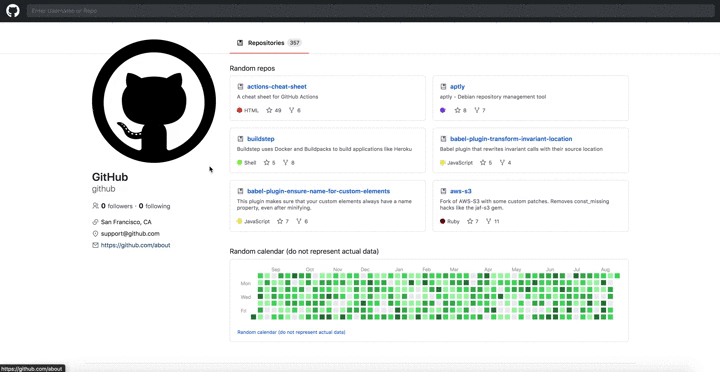

<h1 align="center">
    
</h1>

## 💻 About project

Personal project built using ReactJS and Typescript, which is a clone of Github profile page. You can search for every user in Github (github api using fetch) and access all the repos and profile data. Also, using ThemeProvider, you can alternate between light and dark mode.

Demo: https://githubclonelmr.netlify.app/

## 🛠 Technology

#### **Website**

-   **[HTML5](https://developer.mozilla.org/pt-BR/docs/Web/HTML/HTML5)**
-   **[CSS3](https://www.w3schools.com/css/)**
-   **[Typescript](https://www.typescriptlang.org/)**
-   **[ReactJs](https://pt-br.reactjs.org/)** : **[Styled-Components](https://styled-components.com/)**, **[React Icons](https://react-icons.github.io/react-icons/)**, **[react-router-dom](https://reactrouter.com/web/guides/quick-start)**, **[React Hooks](https://pt-br.reactjs.org/docs/hooks-intro.html)**.

#### **Utilitaries**

-   Editor: **[Visual Studio Code](https://code.visualstudio.com/)**
-   API: **[Github API](https://api.github.com)**

### Prerequisites

Before you begin, you will need to have the following tool installed on your machine:
[Git](https://git-scm.com)

In addition, it is good to have an editor to work with the code as **[VSCode](https://code.visualstudio.com/)**

### Running the web application (Front End)

```bash
# Clone this repository
$ git clone https://github.com/luizmr/github-clone-app.git

# Access the project folder in the cmd/terminal
$ cd github-clone-app

# Use the command below to install all dependencies
$ npm install

# Install http-server
$ npx http-server

# Run the application on terminal
$ npm start

# The server is now running at localhost:3000
```

## 📝 License

This project is under the MIT license.

Made with ❤️ by Luiz Marcelo Rocha
